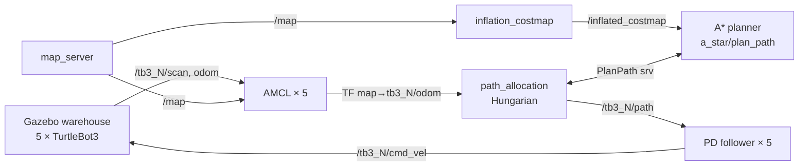

# Multi-Robot Task Allocation for TurtleBot3

A ROS 2 Humble workspace in which **five TurtleBot3 Burgers** split up and carry out a set of warehouse tasks in Gazebo. Each robot localizes itself with AMCL. A central allocator works out who does which task, using A\* path lengths as travel costs in a Hungarian-algorithm assignment. Each robot then drives its own multi-stop route with a PD path follower.


🎥 **Demo video:** [`videos and images/simulation.mp4`](videos%20and%20images/simulation.mp4)

---

## Features

- **Warehouse simulation**: a custom Gazebo warehouse with shelving, pallets and barrels, with five namespaced TurtleBot3 Burgers (`tb3_1` … `tb3_5`).
- **Multi-robot localization**: one shared `map_server` plus one AMCL instance per robot, all in a common `map` frame.
- **Inflated costmap**: static obstacles are grown by 0.55 m so planned paths keep clear of shelves and walls.
- **A\* global planner**: grid A\* on the inflated costmap, available as a ROS 2 service (`a_star/plan_path`).
- **Task allocation**: an event-driven dynamic reallocation loop that repeatedly solves a Hungarian assignment. The cost of each robot–task pair combines:
  - capability match
  - task priority
  - service time
  - A\* path length
  - a battery threshold
- **Multi-stop routes**: each robot receives one concatenated path covering all its assigned tasks in order (`start → T_a → T_b → …`).
- **PD motion control**: one PD path follower per robot.
- **One-command bringup** of the whole pipeline.
- 🚧 **Dynamic obstacle avoidance (work in progress)**: a LiDAR obstacle tracker plus a DWA/RVO local planner. See [below](#-work-in-progress-dynamic-obstacle-avoidance).

---

## System architecture



| Package | Purpose |
|---|---|
| `warehouse_world` | Gazebo world, warehouse model, per-robot TB3 models and spawn launch files |
| `localization` | Shared map server and multi-robot AMCL (`multi_amcl.launch.py`) |
| `path_planning` | `inflation_costmap`, `a_star_planner`, `path_allocation` (+ `hungarian.py`) |
| `custom_interfaces` | `PlanPath.srv`: start/goal `PoseStamped` → `nav_msgs/Path`, length, success |
| `motion_planner` | `pd_motion_planner` path follower + multi-robot launch file |
| `obstacle_avoidance` | 🚧 `obstacle_tracker` + `dwa_planner` (experimental) |
| `dta_bringup` | `bringup.launch.py`: starts everything in order |
| `maps` | Static occupancy map of the warehouse (`map.yaml` / `map.pgm`, 0.05 m/cell) |

### How allocation works

1. `path_allocation` looks up every robot's current pose from TF (`map → tb3_N/base_footprint`).
2. For each available robot and each unassigned task, it asks the A\* service for a path. The path length becomes the distance term of the cost. Results are cached.
3. The Hungarian algorithm (padded for rectangular problems) computes the minimum-cost assignment.
4. A simulated timeline moves forward to the next task completion. The robot that finishes is placed at that task's location, and the remaining tasks are reallocated. This repeats until every task is done.
5. For each robot, the path segments for its task sequence are joined into one `nav_msgs/Path` and published on `/tb3_N/path`.

Robots and tasks are defined in `src/path_planning/path_planning/path_allocation.py`:

- **Robots:** capability vector and battery level.
- **Tasks:** required capabilities, `map`-frame coordinate, service time and priority.

Example output from a run:

```text
[0.0]  Assigned T7 -> R2 (start @ 9.0,  finish @ 15.0, cost 2.507)
[0.0]  Assigned T6 -> R5 (start @ 10.5, finish @ 18.5, cost 0.060)
[15.0] Completed T7 by R2 at 15.0
[15.0] Assigned T4 -> R2 (start @ 34.0, finish @ 38.0, cost 3.081)
...
=== Per-robot schedule ===
R1: T1   R2: T7, T4   R3: T3   R4: T8, T5   R5: T6, T2
```

---

## Prerequisites

- Ubuntu 22.04 with **ROS 2 Humble**
- Gazebo Classic with `gazebo_ros_pkgs`
- TurtleBot3 packages, Nav2 (`nav2_map_server`, `nav2_amcl`, `nav2_lifecycle_manager`), and `tf_transformations`

```bash
sudo apt update
sudo apt install ros-humble-desktop ros-humble-gazebo-ros-pkgs \
                 ros-humble-turtlebot3* ros-humble-navigation2 \
                 ros-humble-tf-transformations
```

> The upstream TurtleBot3 source packages (`turtlebot3`, `turtlebot3_msgs`, `turtlebot3_simulations`, …) are **not** included in this repository. Install them from apt as shown above.

## Installation

```bash
git clone https://github.com/muditkhandelwal16/Multi-Robot-Task-Allocation.git ~/turtlebot3_ws
cd ~/turtlebot3_ws

pip install -r requirements.txt

source /opt/ros/humble/setup.bash
colcon build --symlink-install
source install/setup.bash
```

> `localization/launch/multi_amcl.launch.py` defaults `map_yaml` to an absolute path under `/home/mudit/…`. Update that default to your own path, or override it: `ros2 launch localization multi_amcl.launch.py map_yaml:=/path/to/src/maps/map.yaml`.

## Running

### Full system

```bash
export TURTLEBOT3_MODEL=burger
ros2 launch dta_bringup bringup.launch.py
```

The launch file brings the stages up in order, on fixed delays:

| t (s) | Stage |
|---|---|
| 0 | Gazebo + five TurtleBot3s |
| 5 | Map server + AMCL × 5 |
| 10 | Inflation costmap |
| 15 | A\* planner service |
| 20 | PD followers × 5 |
| 25 | RViz |
| 30 | Task allocation, which publishes routes and then exits |

### Stage by stage (useful for debugging)

```bash
ros2 launch warehouse_world spawn_five_tb3.launch.py
ros2 launch localization multi_amcl.launch.py
ros2 run path_planning inflation_costmap
ros2 run path_planning a_star_planner
ros2 launch motion_planner pd_motion_planner_multi.launch.py
ros2 run path_planning path_allocation
```

In RViz, set the fixed frame to `map` and add `/inflated_costmap` and `/tb3_N/path`.

---

## Screenshots

| | |
|---|---|
|  |  |
| Warehouse world with five robots at their spawn points (top view) | Warehouse world, perspective view |
|  |  |
| Inflated costmap with each robot's TF frame | Inflated costmap, 3-D view |
|  |  |
| Concatenated A\* routes (green) after allocation | Robots partway along their routes |
|  |  |
| Robots moving through the aisles in Gazebo | Terminal output: allocation timeline, per-robot schedule, goals reached |

---

## 🚧 Work in progress: dynamic obstacle avoidance

The robots currently follow their paths independently. Paths avoid **static** obstacles only, so robots can collide with each other or with anything that moves. The `obstacle_avoidance` package is being built to address this.

- **`obstacle_tracker`** runs as a single node:
  - It merges every robot's `/tb3_N/scan` into the `map` frame.
  - It splits the scans into clusters and filters out wall-sized clusters and points near the robots themselves.
  - It tracks the clusters with constant-velocity Kalman filters.
  - It publishes the tracks as RViz markers on `/dynamic_obstacles` and as JSON on `/dynamic_obstacles_data`.
- **`dwa_planner`** runs one instance per robot and replaces the PD follower. It is a Dynamic Window Approach local planner that follows the global A\* path. Each candidate velocity is scored as

  `score = α·heading + β·clearance + γ·speed − δ·RVO_penalty`

  Trajectories that would collide are rejected outright. The **Reciprocal Velocity Obstacle** term is already written but switched off (`DELTA = 0.0`) until the DWA core is tuned.

To try it, start the system as usual but launch the DWA planners instead of the PD followers:

```bash
ros2 run obstacle_avoidance obstacle_tracker
ros2 launch obstacle_avoidance dwa_motion_planner_multi.launch.py
```

---

## Known limitations & roadmap

**Current setup**
- **Allocation is one-shot and open-loop.** The timeline is simulated with a fixed speed model, and nothing is fed back from actual execution. Tasks are not re-planned if a robot is delayed.
- **Robots don't stop at tasks.** Robots follow one concatenated path; service times are modelled in the schedule but robots don't pause at the stops.
- **No inter-robot collision avoidance** in the PD pipeline.
- **Allocation cost scales poorly.** An A\* query for every robot–task pair gets expensive as the fleet or task list grows.
- **Startup depends on fixed timers.** Bringup uses fixed delays instead of readiness checks.
- **The fleet is hardcoded.** The five robots and the task list are defined in several files.

**Next steps**
- Finish DWA tuning, then enable RVO so robots avoid each other reciprocally.
- Add the static map to DWA's clearance check.
- Use cheap heuristic distances as a first pass, and compute exact A\* costs only for promising pairs.
- Feed execution progress back into allocation for true online reallocation.
- Explore auction/market-based and CBBA-style allocation.
- Load robots and tasks from a YAML config instead of code.

---

## Author

**Mudit Khandelwal**: [@muditkhandelwal16](https://github.com/muditkhandelwal16)
